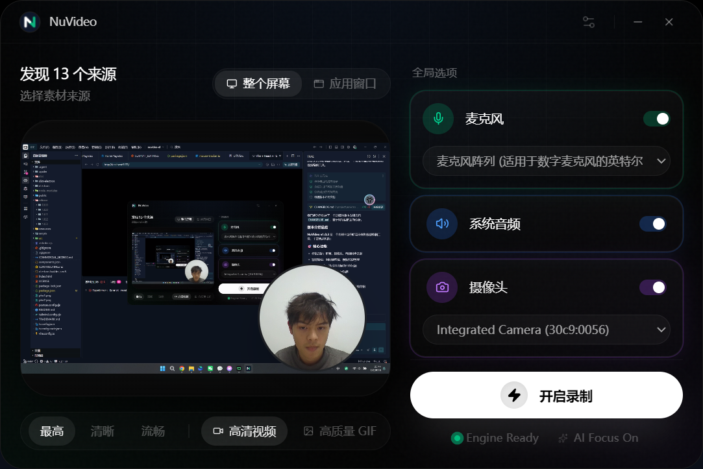
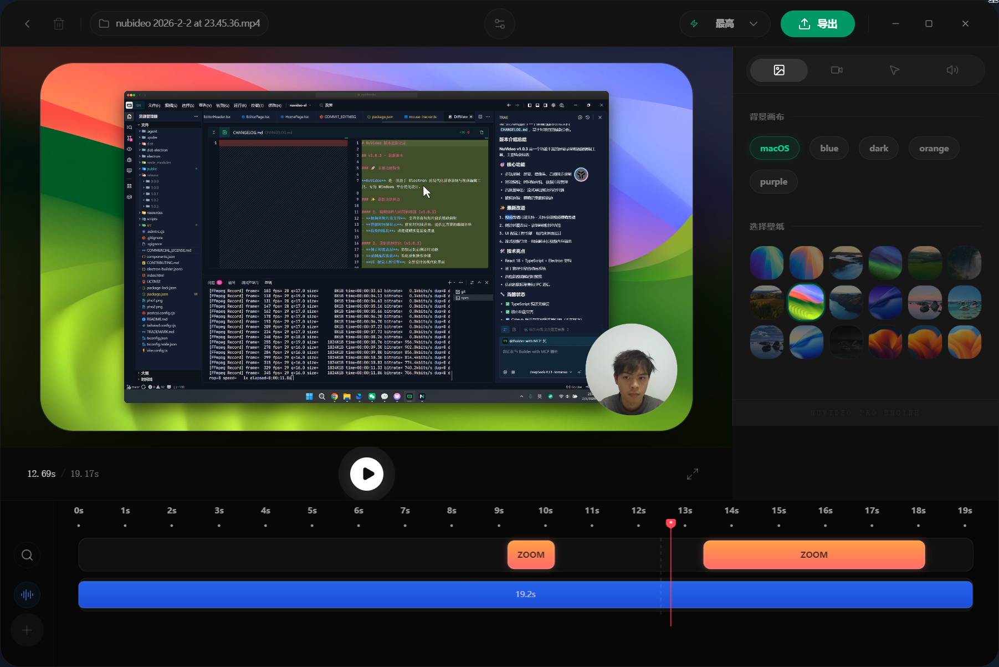

# nuvideo-el

<p align="center">
  
</p>

<p align="center">
  Windows 上的演示录屏工具<br>
  <a href="https://nuvideo.kangcpu.top">官方网站: nuvideo.kangcpu.top</a>
</p>

<p align="center">
  
  
  
  
</p>

---

## 界面预览

<p align="center">
  
  <br><br>
  
  <br><br>
</p>

---

## 简介

**nuvideo-el** 是一个面向 Windows 的现代化屏幕录制与视频编辑工具。它的目标是：让教程/产品演示视频制作更专业、更高效，同时保持简洁直观的用户体验。

项目目前处于 **功能完善阶段**：核心录制、编辑、导出链路已稳定运行，持续优化性能和用户体验。作为独立开发者的项目，欢迎试用与反馈。

## 功能特性

### 🎯 核心功能

- **多轨同步录制**：支持屏幕、摄像头、音频同步录制
- **智能缩放**：可添加智能缩放功能，自动跟随鼠标区域缩放
- **鼠标轨迹追踪**：精确记录鼠标移动和点击轨迹，支持强调效果

### 🚀 最新改进

- **倒计时覆盖层**：录制前倒计时功能
- **UI 视觉工程引擎**：现代化界面设计，Apple/Linear 风格
- **性能优化**：优化鼠标采集频率与录屏帧率同步

### 🛠️ 技术特性

- **实时预览**：基于 `requestVideoFrameCallback` 的高性能预览
- **物理动画系统**：Spring Physics 驱动的流畅动画效果
- **智能缩放**：自动跟随鼠标区域的智能缩放功能

## 技术架构

### 🏗️ 核心技术栈

- **桌面框架**：Electron
- **前端框架**：React 18 + TypeScript + Vite
- **UI 组件库**：Radix UI + 自定义组件 + Tailwind CSS
- **视频处理**：FFmpeg + WebCodecs API + mp4-muxer
- **动画系统**：Framer Motion + 自定义 Spring Physics

### 🔧 核心模块

- **录制模块**：屏幕录制、音频采集、摄像头支持、鼠标追踪
- **编辑器模块**：Canvas 预览、时间轴编辑、导出界面
- **核心引擎**：视频解码、视频分离、智能缩放、物理动画

---

## 快速开始

### 环境准备

- Windows 10/11
- Node.js（建议 18+）
- FFmpeg

### 本地开发

```bash
git clone https://github.com/kang141/nuvideo-el.git
cd nuvideo-el
npm install
npm run dev
```

### 构建打包

```bash
npm run build
```

---

## Roadmap（开发计划）

### ✅ 已完成功能

- [x] **流式视频导出** - 解决长视频内存溢出问题
- [x] **倒计时覆盖层** - 录制前倒计时功能
- [x] **UI 视觉工程引擎** - 现代化界面设计
- [x] **性能优化** - 鼠标采集与帧率同步优化
- [x] **音频和摄像** - 音频区分和电脑摄像

### 🔄 进行中功能

- [ ] **导出性能与稳定性优化** - 持续优化导出流程
- [ ] **基础剪切（Trim/Split）** - 完善视频剪辑功能
- [ ] **音频系统增强** - 系统音频/麦克风录制优化

### 📋 计划功能

- [ ] **更多鼠标/镜头预设** - 丰富的效果模板
- [ ] **云端同步** - 项目文件云端存储
- [ ] **AI 辅助功能** - 智能剪辑和效果推荐

---

## 反馈与贡献

我是一名独立开发者，也是开源新手。欢迎你：

- 提 Issue：bug、建议、使用体验都可以
- 提 PR：小修复/文档补充也非常有帮助

如果你准备提交 PR，建议先看一下仓库里的贡献说明（如果还没有，我会尽快补上）。

---

## 许可证（License）

本项目采用 **双重许可（Dual Licensing）**：

- **开源许可**：`AGPL-3.0-or-later`（见 `LICENSE`）
  - 如果你分发本软件或其修改版，或将其作为网络服务提供给他人使用，需要遵守 AGPL 的开源义务。

- **商业许可**：如果你希望在闭源项目/商业场景中使用，且不希望履行 AGPL 的开源义务，请参考 `COMMERCIAL_LICENSE.md`。

商业授权咨询：可通过 Issue 联系，或邮件至 **[kangdeng28@gmail.com](mailto:kangdeng28@gmail.com)**。

Copyright (c) 2026 Su Zai

_注意：本项目目前处于持续开发阶段，建议仅用于测试与学习。_
