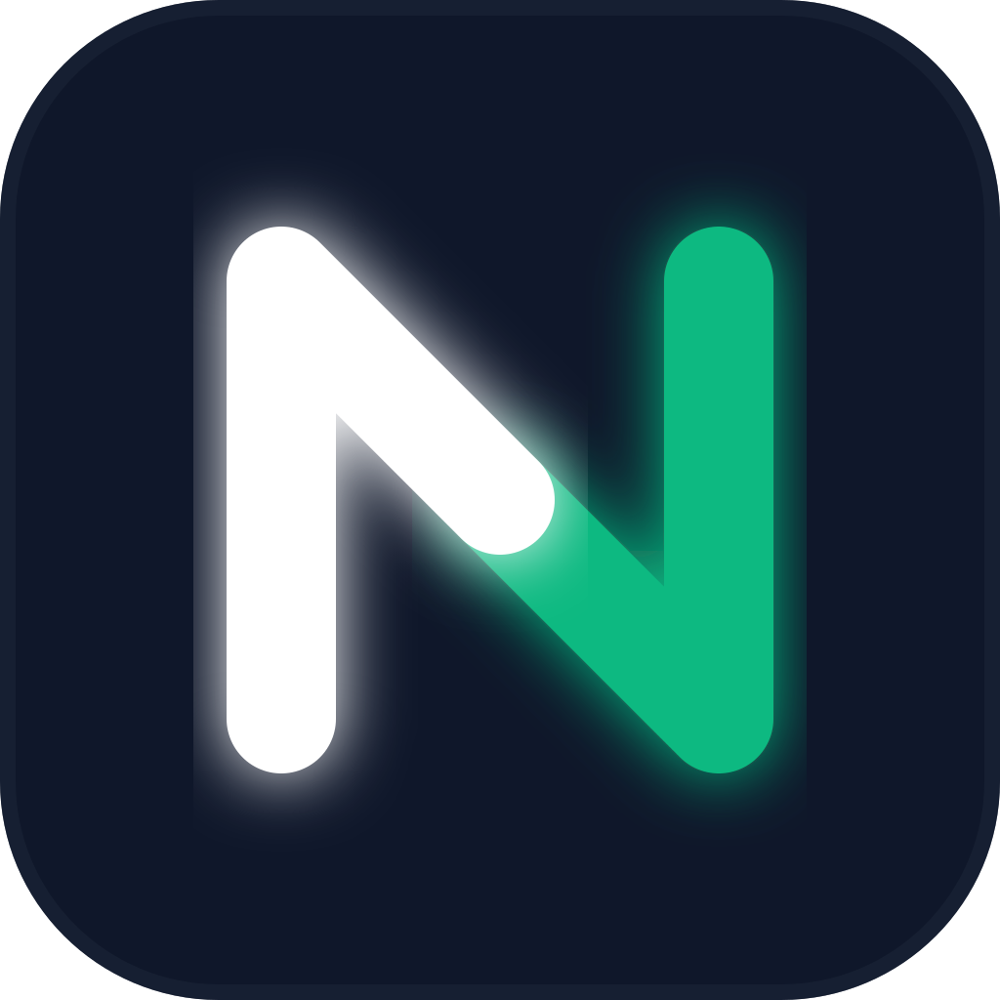

# nuvideo-el

<p align="center">
  
</p>

<p align="center">
  Windows 上的演示录屏工具（受 ScreenStudio 启发）
</p>

<p align="center">
  
  
  
</p>

---

## 简介

**nuvideo-el** 是一个面向 Windows 的录屏与演示视频制作工具。它的目标是：让教程/产品演示视频更清晰、更好看（例如自动跟随鼠标区域、提供鼠标强调效果），同时保持尽量简单的工作流。

项目目前处于 **MVP 阶段**：核心录制、预览与导出链路已经跑通，功能还在持续完善中。作为独立开发者的业余项目，欢迎试用与反馈。

> 备注：本项目受 ScreenStudio 的产品形态启发，但不是其官方作品，也没有任何关联。

## 功能（当前）

- **录制（FFmpeg Sidecar）**：屏幕录制由 FFmpeg 负责，鼠标单独采集，便于后期渲染效果。
- **鼠标强调效果**：支持基础的鼠标高亮/点击反馈（效果会继续迭代）。
- **预览与编辑**：基于 Canvas 的预览渲染与时间轴（MVP 版）。
- **导出 MP4**：使用 WebCodecs + `mp4-muxer` 导出（性能取决于设备与驱动环境）。

## 技术栈

- Electron
- React / TypeScript / Vite
- Canvas 渲染（预览与效果）
- WebCodecs API / mp4-muxer（导出）
- Radix UI / Tailwind CSS

---

## 快速开始

### 环境准备

- Windows 10/11
- Node.js（建议 18+）
- FFmpeg（需要在系统可访问路径中）

### 本地开发

```bash
git clone https://github.com/kang141/nuvideo-el.git
cd nuvideo-el
npm install
npm run dev
```

### 构建打包

```bash
npm run build
```

---

## Roadmap（计划）

下面是一些我想逐步补齐的能力（顺序可能会调整）：

- [ ] 导出性能与稳定性优化
- [ ] 基础剪切（Trim/Split）
- [ ] GIF/WEBM 导出
- [ ] 音频：系统音频 / 麦克风录制与导出
- [ ] 更多鼠标/镜头预设与模板

---

## 反馈与贡献

我是一名独立开发者，也是开源新手。欢迎你：

- 提 Issue：bug、建议、使用体验都可以
- 提 PR：小修复/文档补充也非常有帮助

如果你准备提交 PR，建议先看一下仓库里的贡献说明（如果还没有，我会尽快补上）。

---

## 许可证（License）

本项目采用 **双重许可（Dual Licensing）**：

- **开源许可**：`AGPL-3.0-or-later`（见 `LICENSE`）
  - 如果你分发本软件或其修改版，或将其作为网络服务提供给他人使用，需要遵守 AGPL 的开源义务。

- **商业许可**：如果你希望在闭源项目/商业场景中使用，且不希望履行 AGPL 的开源义务，请参考 `COMMERCIAL_LICENSE.md`。

商业授权咨询：可通过 Issue 联系，或邮件至 **[kangdeng28@gmail.com](mailto:kangdeng28@gmail.com)**。

Copyright (c) 2026 Su Zai

_注意：本项目目前处于持续开发阶段，建议仅用于测试与学习。_
